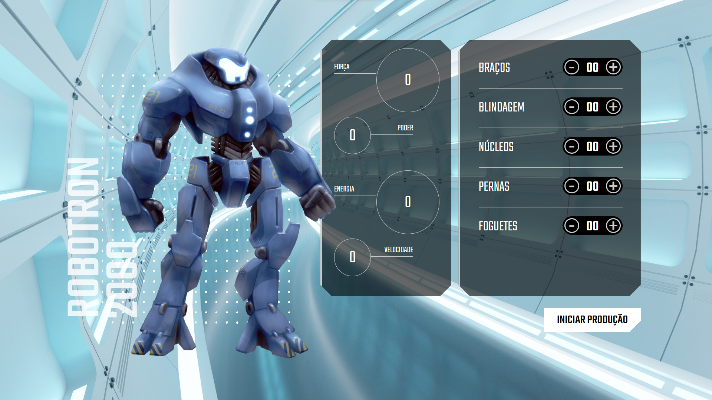

# Robotron 2000

Interface para controlar os atributos do robô, sendo o principal objetivo do projeto a utilização do DOM.

## :computer: Como acessar:
Para acessar o projeto [clique aqui!](https://letzc.github.io/robotron-2000/)

## 🛠️ Tecnologias usadas:
- 
- 
- 

## 💡 Expressões de gratidão
- Agradeço à Alura pelo projeto guiado. Adorei aprender mais sobre o DOM neste projeto!
